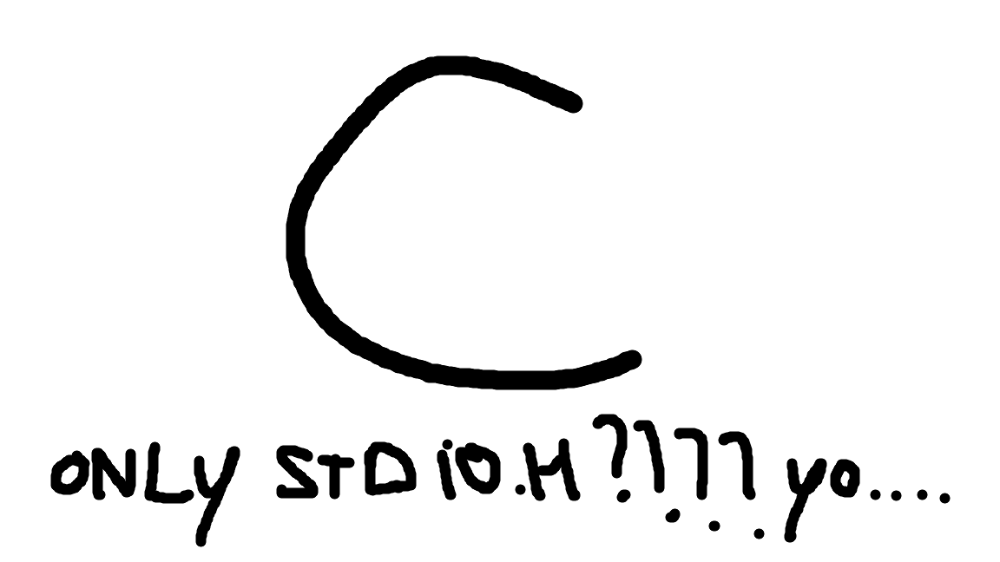

*Latest README update in 10/05/2026 23:28 PT*
> # This is C


> ### **Introduction**

Hello how are you? ^.^

I'm Diogo and this is a very small project of
mine. I'm trying to collect every single
simple code for people who want to learn how to
start off with C.

All the codes here only use the stdio library.
This is meant so that its able to proof that
you can do many things with the most simple yet
very complex, famous yet unknown library.

I am doing this mainly for two reasons: I want 
to develop my knowledge on the C language; and
I want to help other people who want to use
this for educational purposes on exercises,
projects or other needs related to academics.

ATTENTION: I am not promoting the use of these
codes to bypass all the essential learning part
of programming, repelling any responsability to
if that is happening or not.

> ### **Repo structure, Prefixes and Version Control**

> **Repo structure**

I'm a very ORGANIZED person. This project is supposed to be very simple, so it will onl have 3 things:

1. THE FILE ::: this_is_so_c.c;
2. THE README ::: README.md;
3. THE IMAGE ::: static/image.png;

and... that's it!

> **Prefixes**

The prefixes will be available on the **three** major changing fields of the repository:

| Prefix | Meaning | Example |
|--|--|--|
|`doc/`|Changes to README.md|doc/sectionname-section|
|`design/`|Changes to static/image.png|design/imagename|
|`chapter/`|New chapter|chapter/chaptername|
|`code/`|New code on a chapter|code/chaptername-codename|
|`chore/`|Changing a code or text|chore/whatchanged|

> **Version Control**

```
Version 1.0.0

First digit: File organization (goes 1 up every refactor on the organization standard);
Second digit: Chapter created (goes 1 up every new chapter);
Third digit: Small changes (goes 1 up every added code).
```
> ### **Help?**
I mean... ok!

E-mail: aalsosmurf@gmail.com

(use it wisely.......)